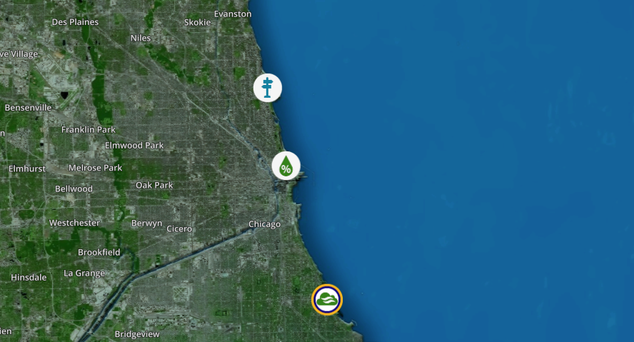

# Digital Twin for the city of Chicago

In this repository, we introduce a smart city digital twin of chicago. 

## :smirk:Ok but...what is a digital twin  ?

A digital twin is a virtual representation of a product, which can be used for the conception, the testing, the surveillance, the optimization, and the maintenance of a product.
It is a concept that combines the internet of objects and machine learning.

A digital twin requires three parts:
 * The physical product in a real environment,
 * Its digital twin in a virtual environment,
 * The data which connects them both

A digital twin is an essential part for a smart city. In this bid, we are working on creating a digital replica of the city of Chicago. In the digital replica, we display data from sensors placed across the beach. This can be used for urban planning, simulate natural catastrophes, and prepare for them.

## :trollface: Gimme the magic formula behind this

To begin with, captors and sensors are required to obtain data from the physical product in a real environment. In our case, sensors which 
are placed at three different beach stations located in Chicago are used. The stations are located at Foster Avenue, Oak Street,
and 63rd Street. Every hour, the data collected by the sensors is uploaded to a public dataset. We obtained the coordinates of the sensors (Courtesy of Kendall W. Anderson)

Our objective is to enable a user to view the data, interact with the sensors, change the data sensors in the data to see how the environment reacts.
For example, a user can view how the digital city changes if the temperature is changed for a date in the future.

:unamused: **I just find it funny how...no getting started info is included**

## Getting Started 

Let's get to this.
 1. Download [Unity](https://store.unity.com/#plans-individual/ "Unity"), the game engine which we are using to develop the digital twin in 3D
 2. Download the WRLD 3D [SDK](https://www.wrld3d.com/developers#DEVELOPERS/ "SDK"), which provides pre-built cities 3D models (including Chicago).
 3. Installing 
      * Clone or download this repository 
      * Open Unity Hub. Click on **ADD** and add the "digital-twin-chicago" folder.
      * :snail: Patiently wait for Unity to load.
      * Once Unity has loaded, navigate to **assets** on the top bar. Import Package > New Package > Add the WRLD 3D package.
      * Once the WRLD3D packagae has been imported, you'll be prompted to enter your API key. Follow the steps that will be displayed 
      in the application to register your API key with WRLD3D.
      * Once the key is validated, you can begin running, modifying scripts within Unity.
      
  4. Running the digital twin using Unity
      * Use the search bar to find the **wrld Map** scene. Right click on it and open it.
      * In the hierarchy tab, locate the **wrld Map** game object. Click on it. Then, switch to the inspector tab. 
      Verify that you have the right API key. Verify that your latitude and longitude coordinates match one of the stations (Coordinates are in the Coordinates Folder).
      This ensures that when you run the digital twin, you start at the right point in Chicago.
    
      * Click the :arrow_forward: button in Unity. This will run the digital twin, your starting point should be at one of the beach weather stations. 
      To stop running, click on again on the :arrow_forward button.

## Research

 For more research on digital twins and their various applications, please refer to the papers folder.
